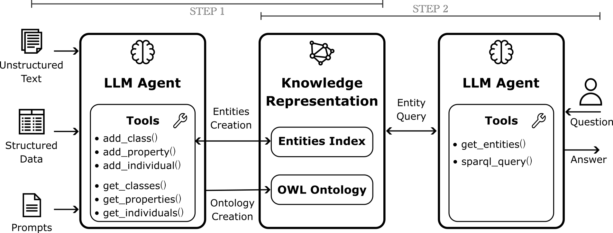

# PoC: LLM-Based Ontology Representation and Retrieval

This project presents an approach based on a simple LLM agent that infers an OWL ontology from data, and another agent that retrieves data and responds to user queries. 

The project contains a Proof of Concept (PoC) implementation based on a simple illustrative scenario. Its objective is to present an approach to address some known challenges of using ontologies with (un)structured data in synergy with LLMs.


## Scenario
   
The questions this PoC addresses are:
 1. How can I build logic models (usually based on rules) that can handle complex data coming from different sources?  
 2. How can an LLM leverage an ontology to retrieve data?

I address these questions as:
 1. The data models can be generated through LLM, based on documents. Thus, prior knowledge can be modelled by the developer through LLM prompts and agents. Unlike traditional expert systems, there is no need to manually define complete data representation models. Instead, the prompts can specify qualitative and partial information, and the LLM can still generate a consistent representation models.  
 2. A logically structured data representation might be explored by the LLM itself (e.g., via SPARQL queries) to retrieve the relevant information, and I aim to see its performance. 
 
Therefore, the PoC considers an edge-case scenario where:
 1. The prior knowledge encoded in the LLM prompts for ontology creation is qualitative and limited.  
 2. The LLM answers user questions by retrieving data *only* from the ontology, without relying on embeddings or vector search. This emphasize the ontology’s role in data retrieval, even though vector-based methods are suitable for this scenario.
 

### Illustrative Input Data 

This PoC involves two examples of data types (structured and unstructured, respectively):
 - A JSON-like data structure representing a product taxonomy with various characteristics (see [product_data.json](data/product_data.json)). This data was extrapolated from a website using a semi-supervised process involving CSV and LLM-based manipulations.  
 - A set of short textual guidelines about product logistics, obtained through a chunking process applied to a text document (see [logistics.json](data/logistics.json)).

Although the dataset is small for demonstration purposes, it was derived from real products. Names and quantities have been replaced with dummy values for privacy. 


### LLM Orchestration

The implemented PoC involves two separate steps:
 1. An LLM agent creates a list of *entities* (i.e., symbols of classes, individuals, and properties). Then, it converts the entities into an OWL ontology, which is stored in a file for simplicity.  
 2. Another LLM agent accesses the stored data and explores the ontology to answer user questions.



##### Entities Index

EntitiesIndex is a data structure that supports the creation and usage of the ontology. It contains entities that will (1) be encoded in the ontology during the first step, and (2) used in SPARQL queries in the second step (in this case only the `name` is required).  

In particular, `EntitiesIndex` is a dictionary structured as the following. Note that from this structure, it is possible to derive the input and output data of the LLM tools addressed below.

```json
{
    "tbox_classes": {
        "ProductCategory": {
            "name": "ProductCategory",
            "subclassOf": ["Product"],
            "role": ["Top-level product category"]
        },
        "RetainingWalls": {
            "name": "RetainingWalls",
            "subclassOf": ["Product", "ProductCategory"],
            "role": ["Category for retaining walls products"]
        },
        ...
    },
    "tbox_prop": {
        "id": {"name": "id", "role": ["Unique product identifier (string)"]},
        "name": {"name": "name", "role": ["Human-readable name"]},
        ...
    },
    "abox_ind": {
        "Yellow": {
            "name": "Yellow",
            "classes": ["Color"],
            "properties": [["name", "Yellow"]],
            "role": ["Color value"]
        },
        "SideLine_CURB_SP8": {
            "name": "SideLine_CURB_SP8",
            "classes": ["ProductVariant", "Product"],
            "properties": [
                ["piecesPerPack", "36"],
                ["variantLabel", "CURB SP8"],
                ["weightKg", "39"]
            ],
            "role": ["Variant of SideLine"]
        },
        ...
    }
}
```


##### Step 1: Ontology Creation

This step exploits an LLM agent with access to the following tools (see [tool_interface](src/tool_interface.py)):
 - **`add_class`**: adds a new class to the `EntitiesIndex`,  
 - **`add_property`**: adds a new property (i.e., relations between instances and literals) to the `EntitiesIndex`,  
 - **`add_individual`**: adds a new instances (belonging to classess and involved in properties) to the `EntitiesIndex`,   
 - **`get_classes`**: returns the classes in `EntitiesIndex`,  
 - **`get_properties`**: returns the properties in `EntitiesIndex`,  
 - **`get_individuals`**: returns the individuals in `EntitiesIndex`.

During this step, the LLM is instructed with a prompt that includes (see [prompts.py](src/prompts.py)):
 - generic instructions about OWL-based representations,  
 - specific (but not detailed) information about the input file and extraction goals,  
 - portions of input data to be extrapolated into the ontology.  

When the tools above have been used by the LLM to populate the `EntitiesIndex`, the LLM is invoked again with a prompt that asks to map all entities into an OWL ontology, which is stored in a file (e.g., [ontology.owl](data/outcomes/20251105_185955/ontology.owl)).

This first step is performed by the [onto_builder.py](src/onto_builder.py) script, which output is stored in the [entities_index.json](data/outcomes/20251105_185955/entities_index.json), [ontology.owl](data/outcomes/20251105_185955/ontology.owl) and [building.log](data/outcomes/20251105_185955/building.log) files.


##### Step 2: SPARQL-Based Data Retrieval

The second step involves another LLM agent with access to two tools (see [tool_interface](src/tool_interface.py)):
 - **`get_entities`**: which returns the `name` and `role` of classes, properties and individuals from the `EntitiesIndex`. It does not return other semantic definitions among entities (e.g., `subclassOf`, `properties`, etc.),  
 - **`query_ontology`**: runs a SPARQL query generated by the LLM to explore the ontology and retrieve data.  

In this step, the LLM is instructed with a prompt containing the user's questions, and LLM can only use SPARQL queries to retrieve the the data for answering them.

This second step is performed by the [onto_user.py](src/onto_user.py) script, which output is stored in the [answers.log](data/outcomes/20251105_185955/answers.log).

### Results

##### Ontology Creation

The [ontology.owl](data/outcomes/20251104_225829/ontology.owl) file encodes the ontology created by the LLM. Notably:
 1. The LLM represented in the ontology structured data better than unstructured text.  
 2. The LLM represented relations between literals better than between individuals.  
 3. The generated ontology had few redundancies and is human-readable (e.g., suitable for explainability and maintainability).
 4. Since the LLM had limited prior knowledge, it created a granular ontology with about 900 facts.  

##### SPARQL-Based Data Retrieval

The [test.json](data/test.json) file contains 20 user questions with expected responses. The [answers.txt](data/outcomes/20251104_225829/answers.txt) file contains the LLM answers: 16 of which were correct, 1 was partially correct (the 14th question), 1 was incorrect (the 7th), and 3 had no answer (the 10th, 17th, and 18th).

Overall, I observed that:
 - The LLM can explore the ontology via SPARQL, and answers have been found with chains of queries.
 - The LLM retrieves information not only from logical rules but also from the meaningful `names` and `roles` it assigned to classes and relations.  
 - The LLM can explain its reasoning and query process through the generated SPARQL queries. This also limits hallucinations.


##### Computation Time

Since I used qualitative and limited prompts, the LLM tended to represent knowledge in the ontology with high granularity, and this affects computation time and costs. On the one hand, a fine granularity well deals with general-purpose users' questions. On the other hand, high computation time is a crucial issue for big data. 

To improve computation time, I would not recommend using a single big ontology with high granularity that copes with unstructured data and solves a heterogeneous variety of tasks. Instead, I would prefer having many small ontologies specialised for specific tasks. Then, these ontologies can be orchestrated when data needs to be merged across different contexts (I provide more details in this [article](https://arxiv.org/abs/2105.02264)). In this case, ontologies can be integrated with other data structures (e.g., vector and graph DBs), allowing for the use of the best data representation for different contexts.


### Limitations and Improvements

This PoC shows that an ontology can be created by an LLM with minimal prior knowledge. However, providing more structured prior knowledge about the data and desired outcomes would likely improve accuracy.

It also shows that the LLM can independently explore the ontology to search for data. Combining this approach with vector-based retrieval would improve performance.

This PoC has significant room for improvement. Some current limitations include:
 - Only a fragment of OWL semantics has been implemented.  
 - The LLM cannot modify existing entities in the ontology (e.g., tools like `remove_property` are missing).  
 - OWL Reasoner could be leveraged to check ontology consistency and implement self-improving and error recovery methods for LLM.
 - A fine-tuned LLM model for ontology creation could shorten prompts and improve accuracy.  
 - The system would be faster if multiple agents were used concurrently.
 - Retrieving data only with SPARQL is an extreme case. Ontologies integrated with Graph or Vector DBs would improve data retrieval performance. 


## Project Structure

The repository contains the following folders and files:

 - [presentation/](presentation/): contains the slides and images of a small presentation of this PoC
   - ...

 - [data/](data/): 
   - [product_data.json](data/product_data.json): structured description of products and their features.  
   - [logistics.json](data/logistics.json): unstructured guidelines as chunked text.  
   - [test.json](data/test.json): user questions and expected results.  
   - [outcomes/](data/outcomes/): files generated by the code.  
      - [ontology.owl](data/outcomes/20251104_225829/ontology.owl): the ontology generated by the LLM.  
      - [entities_index.json](data/outcomes/20251104_225829/entities_index.json): definitions of entities in the generated ontology.  
      - [building.log](data/outcomes/20251104_225829/building.log): the system logs while creating the ontology.
      - [answers.log](data/outcomes/20251104_225829/answer.log): the system logs while the LLM answers the user’s questions.

 - [src/](src/): 
   - [prompts.py](src/prompts.py): defines all prompts for the LLM.  
   - [entities_index.py](src/entities_index.py): contains classes, properties, and individuals generated by the LLM.  
   - [tools_interface.py](src/llm_onto_tools.py): defines the tools used by the LLM.  
   - [onto_toolkit.py](src/onto_toolkit.py): defines an helper function to invoke the LLM with specified tools.
   - [onto_builder.py](src/onto_builder.py): runnable script that uses the LLM to generate the ontology.  
   - [onto_user.py](src/onto_user.py): runnable script that makes the LLM answer user questions.

The code is based on the `openai` and `rdflib` libraries. In this PoC did not use specific libraries (e.g., LangChain) in order to do not hide implementation aspects. 

---

*Author:* Luca Buoncompagni  
*Date:* 6/11/2025
